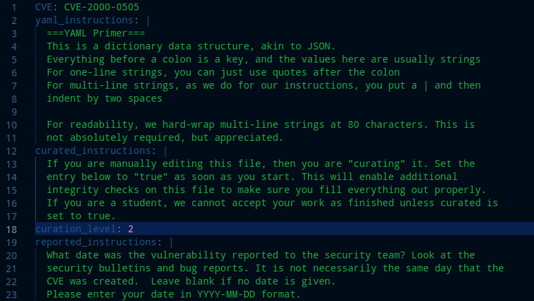
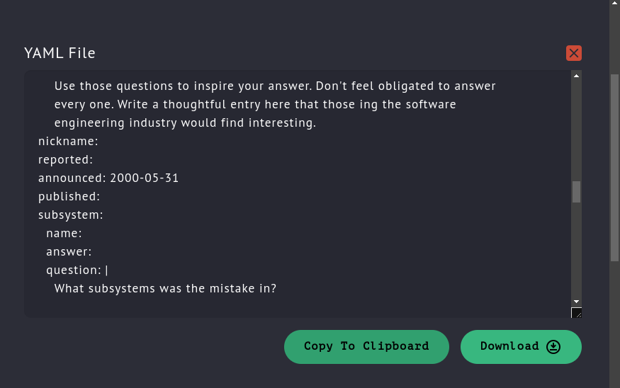

# Overview

The Vulnerability History Project relies upon a massive effort to collect, correct, and annotate vulnerability history data. We call this process **curating**. By following this guide, you will learn how to assist the Vulnerability History Project in recording the history of various vulnerabilities.

### Who should curate?

Anyone with **some programming experience** can curate a vulnerability. A vulnerability is just an engineering mistake, usually manifesting itself in code; the code is all you need to understand.

_You do not need to be a security expert or hobbyist_. In fact, curation is a fantastic learning experience. Maybe curating a vulnerability will be how you learn about your first vulnerability!

_You do not need to be an expert in the project_. You don’t need to have written an entire browser to understand the basics of what happened in a specific, narrow situation.

### Who should I write for?

Your target audience should be anyone with **some programming experience**. You are writing to your peers, both junior and senior. You can assume that your audience knows the basics of programming. For example, technical words like “pointers” are okay.

# Investigate Vulnerabilities

### Choosing a CVE to curate

If you’re finding it difficult or overwhelming to choose a vulnerability, the curation tool has a built-in “random vulnerability” button that will choose a random uncurated vulnerability in the database. If you have knowledge or an interest in a certain topic, programming language, or software, you can search for keywords based on your knowledge or interests, and can more easily find a vulnerability that will be engaging to curate.

It is a good idea to familiarize yourself with the technology your vulnerability was found in. Take some time to look over their documentation, what the rest of the world says about them, and anything else you can think of to familiarize yourself with the project and product. For each technology, you will find a list of resources below:

### Chromium Browser

- [Website](https://www.chromium.org/Home/)

- [Docs](https://chromium.googlesource.com/chromium/src/+/refs/heads/main/docs/README.md)

- [Discussions](https://groups.google.com/a/chromium.org/g/chromium-discuss)

### Linux Kernel

- [Website](https://www.kernel.org/)

- [Mailing list archives](https://lkml.org/)

- [Docs](https://www.kernel.org/doc/html/v4.16/index.html)

  - [Getting started for new kernel developers](https://www.kernel.org/doc/html/v4.16/process/howto.html)

  - [Dev and testing tools](https://www.kernel.org/doc/html/v4.16/dev-tools/index.html)

### Django

- [Website](https://www.djangoproject.com/)

- [Docs](https://docs.djangoproject.com/en/5.0/)

- [Forum](https://forum.djangoproject.com/)

### Apache Struts

- [Website](https://struts.apache.org/)

- [Docs](https://struts.apache.org/getting-started/)

- [Mailing lists](https://struts.apache.org/dev-mail.html)

### FFmpeg

- [Website](https://ffmpeg.org/)

- [Docs](https://ffmpeg.org/ffmpeg.html)

- [Mailing lists](https://ffmpeg.org/contact.html#MailingLists)

### systemd

- [Website](https://systemd.io/)

- [Man pages](https://www.freedesktop.org/software/systemd/man/latest/)

- [GitHub issues](https://github.com/systemd/systemd/issues?q=is%3Aopen+is%3Aissue)

### Apache HTTPD

- [Website](https://httpd.apache.org/)

- [Docs](https://httpd.apache.org/docs/)

- [Mailing list archives](https://lists.apache.org/list.html?dev@httpd.apache.org)

### Apache Tomcat

- [Website](https://tomcat.apache.org/)

- [Docs](https://tomcat.apache.org/tomcat-8.5-doc/index.html)

- [Mailing lists](https://tomcat.apache.org/lists.html)

As you learn more about your vulnerability, you will _undoubtedly_ encounter terminology you have never heard. There is a glossary that provides definitions for common terms related to vulnerabilities, computing security, and software [here](glossary.md).

# Forking and cloning the vulnerability repository

NOTE: If you have already curated a vulnerability and have a copy of the forked repository on your local machine, you should update it before curating another. See [this](https://docs.github.com/en/get-started/using-git/getting-changes-from-a-remote-repository#pulling-changes-from-a-remote-repository) for instructions on how to do that. Once your repository is updated, you can proceed directly to your preferred way of curation.

Once you have chosen your vulnerability, the next step is to fork and clone the vulnerability repository located here: [VulnerabilityHistoryProject/vulnerabilities](https://github.com/VulnerabilityHistoryProject/vulnerabilities)

If you do not know how to fork or clone a repository, GitHub provides documentation on [forking](https://help.github.com/articles/fork-a-repo/) and [cloning](https://docs.github.com/en/repositories/creating-and-managing-repositories/cloning-a-repository).

Once you have your repository, you need to open the YAML (.yml) file which corresponds to the CVE identifier of your chosen vulnerability. These can be found in the ```cves``` directory and be opened with any modern text editor. From here, you need to locate and change the ```curation_level``` value to ```2```.



This is the only step that requires manually editing the YAML file, so if you would like to use the curation tool on the website (recommended for beginners), save and close the file, and continue to the section below marked “Using the Curation Tool”. If you would prefer manually editing the YAML file, follow this [link](#manual-curation).

# Using the Curation Tool

For those unfamiliar or uncomfortable with YAML, an on-site curation tool has been provided for ease of contribution. The curation tool can be found at [https://vulnerabilityhistory.org/curate](https://vulnerabilityhistory.org/curate).

Once the tool is launched, there are several options to start a curation. Firstly, a random CVE can be assigned to you from one of the VHP’s eight projects. Secondly, you can search for a specific vulnerability within the VHP’s resources if you have a specific vulnerability in mind. If you complete this search and do not find the vulnerability you wish to curate, you can enter its designation under the “Register New Curation” box.

Once a vulnerability is selected, proceed through the curation tool, answering all of the questions provided. Each question contains a set of instructions on how to answer it, including the format your answer should be in. The questions within the curation tool correspond with questions present within each YAML file, and curation tools for each project have questions specific to said project. 


After completing the curation tool, click the “View YAML” button to view a precompiled YAML file based on your curation. Then, you can copy the text to your clipboard or download it for submission.



# Manual curation

After opening the YAML file, you’ll first see brief instructions on how YAML syntax works. For completeness, they are provided here:
```yaml
This is a dictionary data structure, akin to JSON.
Everything before a colon is a key, and the values here are usually strings
For one-line strings, you can just use quotes after the colon
For multi-line strings, as we do for our instructions, you put a | and then indent by two spaces

For readability, we hard-wrap multi-line strings at 80 characters. This is not required, but appreciated.
```

You should also notice that the ```curation_level``` value is set to ```2```.

Proceed through the file, answering all of the questions provided. An in-depth example of how to curate a vulnerability, including suggested avenues to obtain the needed information, is available [here](https://www.se.rit.edu/~swen-331/projects/history/#vulnerability-from-chromium-cve-2011-3092). Each question contains a set of instructions on how to answer it, including the format your answer should be in. Examples of how to format certain fields are provided below, taken from this [kernel vulnerability curation](https://github.com/VulnerabilityHistoryProject/vulnerabilities/blob/128ad516c505ab302b8c3ec9151143fcbd0dcb15/cves/kernel/CVE-2021-28950.yml):

One-line string:
```yaml
reported_date: '2021-03-20T2015:13.100'
commit: 775c5033a0d164622d9d10dd0f0a5531639ed3ed
```

Multi-line string: 
```yaml
description: |
	The Linux kernel had a vulnerability in their filesystem code that manages
	fusing multiple references to a file (i.e. "inodes"). They had a situation
        where they forgot to clear out a cache, which could lead to the file system
        slowing way down.
```

True/false answer:
```yaml
answer: true
```

NOTE: The order of the fields in the YAML files might differ depending on the project chosen.

Examples of a few completed YAML files are linked here:

Linux kernel: [CVE-2021-28950](https://github.com/VulnerabilityHistoryProject/vulnerabilities/blob/128ad516c505ab302b8c3ec9151143fcbd0dcb15/cves/kernel/CVE-2021-28950.yml)

systemd: [CVE-2013-4327](https://github.com/VulnerabilityHistoryProject/systemd-vulnerabilities/blob/cd062445b03b15ba2e08a56db00cdf45d56c0e0a/cves/CVE-2013-4327.yml)

FFmpeg: [CVE-2017-14054](https://github.com/andymeneely/ffmpeg-vulnerabilities/blob/a303c3a786a5c2607d8de84d1474de91f8fceb4e/cves/CVE-2017-14054.yml)

Chromium: [CVE-2011-3092](https://github.com/VulnerabilityHistoryProject/chromium-vulnerabilities/blob/master/cves/CVE-2011-3092.yml), [CVE-2013-6665](https://github.com/VulnerabilityHistoryProject/chromium-vulnerabilities/blob/dev/cves/CVE-2013-6665.yml)

### YAML FAQ:
**Does indentation matter?**

YES! Indentation has semantic meaning. Imagine YAML as if a Python person was redesigning JSON to be more human-friendly.

**What is with the pipe character?**

This is a [literal block](http://yaml.org/YAML_for_ruby.html#blocks), which means that newlines are preserved. Again, indentation matters here too.

**Should I use string keys or symbol keys?**

For example, ```commit:``` or ```:commit:```. Keep with the format written in the file. We tend to be flexible toward both. We prefer string keys.

# Submitting your curation

After your YAML file is complete, place it within the folder corresponding to the project your curated vulnerability originates from, either by replacing the text already present or adding a new file if you are curating a currently absent vulnerability. Commit your changes to your forked repository, then [submit a merge request](https://docs.github.com/en/pull-requests/collaborating-with-pull-requests/proposing-changes-to-your-work-with-pull-requests/creating-a-pull-request-from-a-fork) to the main branch. The maintainers of the Vulnerability History Project will review your changes shortly. If approved, your request and changes will be included in the Project’s archives. 
